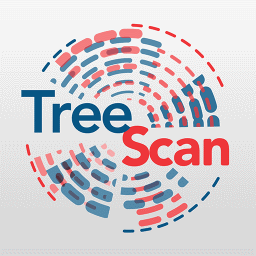

 TreeScan - Software for the Tree-Based Scan Statistic
====
TreeScan™ is a free data mining software that implements the tree-based scan statistic, a data mining method that simultaneously looks for excess risk in any of a large number of individual cells in a database as well as in groups of closely related cells, adjusting for the multiple testing inherent in the large number of overlapping groups evaluated. Developed for disease surveillance, it can be used for the following types of problems:

-   In pharmacovigilance, it can be used to simultaneously evaluating hundreds or thousands of potential adverse events and groups of adverse events, to determine if any one of them occur with higher probability among patients exposed to a particular pharmaceutical drug, device or vaccine, adjusting for the multiple tests inherent in the many adverse events evaluated.
-   Also in pharmacovigilance, for a particular disease outcome such as liver failure, it can be used to simultaneously evaluate if it occurs with increased risk among people exposed any of hundreds of pharmaceutical drugs, or groups of related drugs, adjusting for the multiple testing inherent in the many drugs evaluated.
-   In occupation disease surveillance, it can be used for a particular disease to evaluate whether certain occupations, or group of related occupations, are at higher risk to die from that disease.

You can find more information about TreeScan on the <a target="_blank" href="https://www.treescan.org/">homepage</a> and in the <a target="_blank" href="https://www.treescan.org/cgi-bin/treescan/register.pl/treescan.v2.1.userguide.pdf?todo=process_userguide_download">user guide</a>. Prebuilt installers for Windows, Linux, and macOS are <a target="_blank" href="https://www.treescan.org/download.html">also available</a>.

License
-------

TreeScan source code is released under the following terms:

Copyright &copy; 2023 [Martin Kulldorff](mailto:kulldorff@treescan.org)

Without warranty of any kind, permission is hereby granted to any person to copy, publish, distribute, and share all or portions of this open-source TreeScan Software; to use, modify, merge, adapt, and build upon the Software; and to publish and distribute derivates of the Software, so long as (i) attribution is given to the creator, (ii) the above copyright and this permission notice is included with all copies of the Software and portions of the Software, and (iii) any published, distributed or shared modification, adaption or derivative of the Software must be shared under identical licensing and permission terms.

Building Native Binaries
-----------
The following are the prerequisites for compiling the command-line C/C++ application and dynamic-link library (.dll) / shared objects file (.so) / java native interface library (.jnilib). 
### General Prerequisites
- Boost C++ Libraries, current version <a target="_blank" href="https://www.boost.org/users/history/version_1_81_0.html">1.81.0</a> (libraries do not need to be build).
- Java Development Kit 17
### Windows
#### Prerequisites
- Visual Studio 2022
- Microsoft Windows SDK v10.0 (or newer)

The Visual Studio Solution references relative paths to the Boost library and JDK C++ headers. These can be either copied into the repository directory or a symbolic link can be created using mklink to reference shared resources:
- boost\boost_1_81_0\
 ex. mklink /d boost *"C:\Users\joeuser\boost"*
- jdk\include\
  ex. mklink /d jdk *"C:\Program Files\Eclipse Adoptium\jdk-17.0.9.9-hotspot"*
### Linux
#### Prerequisites
- GCC (compiled with 4.8.5 or 8.5.0 currently)

The Linux binaries are built through the [Linux build_binaries](scripts/linux/build_binaries) shell script.
### macOS
#### Prerequisites
- Apple clang 15

The macOS binaries are built through the [macOS build_binaries](scripts/mac/build_binaries) shell script.

Building Java User Interface
-----------
The Java user interface provides the graphical front-end to the native library file written in C/C++ (.dll/.so/.jnilib).
### Prerequisites
- NetBeans (<a target="_blank" href="https://netbeans.apache.org/">Version 19</a>)
- Java Development Kit 17

Architecture
-----------
See our [architecture document](architectural.md) for an overview of the source code design.
