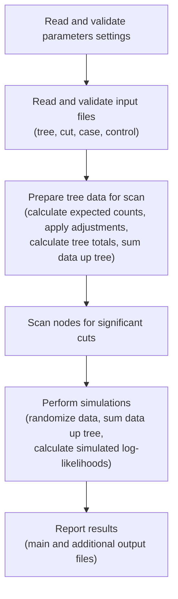
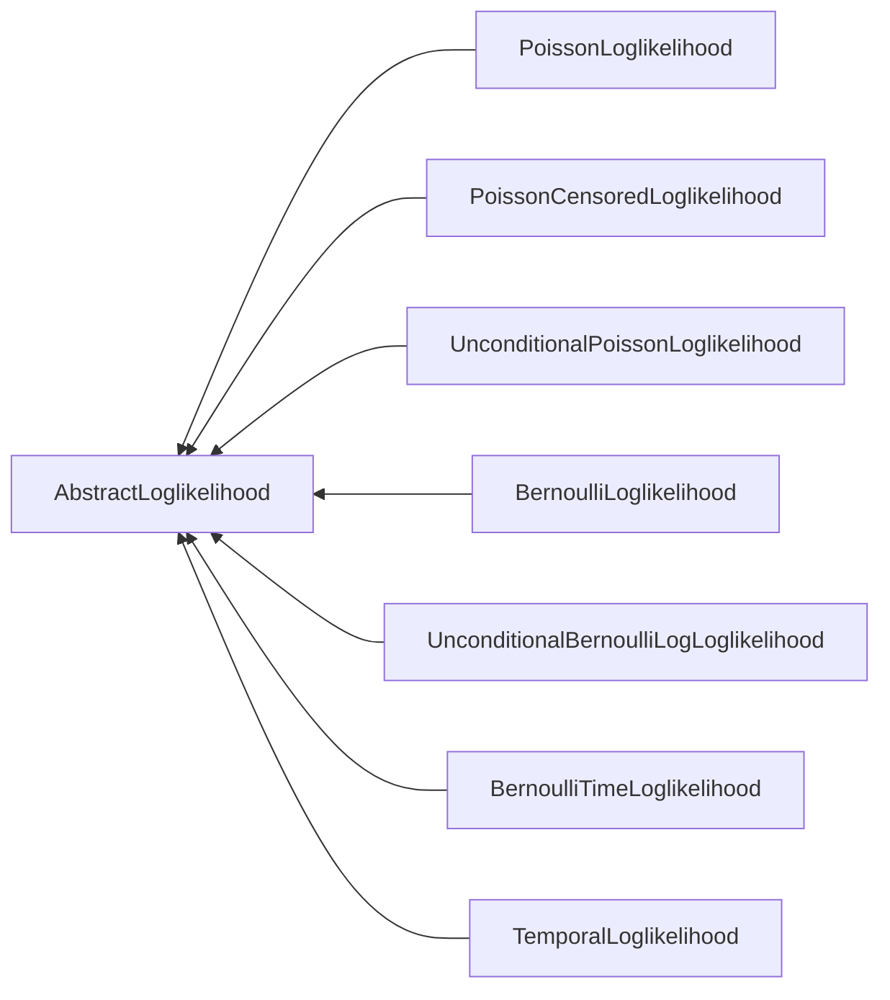
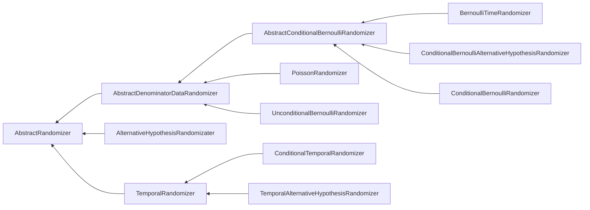

Architecture
==== 
> An Architectural Guide for Developers

 Source Code Organization Overview
-------
### Calculation Engine
The core of the source code is the calculation engine, which defines the many algorithms and supporting functionalities which operate on the parameter settings and data files to produce the analysis result files. It is divided into 7 logical groupings of source code which largely reflect the object oriented design: log likelihood, output, print, randomization, runner, utility, and parameters. The source code is C/C++ and compiles on Windows, Linux, and macOS.

### Shared Library
The shared library extends the calculation engine to expose the analysis routines to a larger program - in this case, the graphical user interface. The library uses the Java Native Interface to bridge between the calculation engine and the Java GUI. The library code is also writen in C/C++ and compiles on Windows, Linux, and macOS.

### Graphical User Interface
The graphical user interface is written in Java. The GUI provides the user with a friendly interface for creating, editing, and executing analyses. All analysis execution is performed in the calculation engine, with the shared library facilitating the interactions between Java and C/C++ code.

### Calculation Engine Execution Flow

### Key Classes and Inheritance
#### [Central Classes: ScanRunner, NodeStructure, CutStructure](calculation/runner/ScanRunner.h)
The ScanRunner class orchestrates the overall process described in the execution flow. The relationships and data of the tree are stored in the NodeStructure class and a collection of these objects then becomes the tree definition.
Once cuts of interest are detected when scanning the nodes of the tree, that cut definintion is stored in a collection of CutStructure objects.

#### [Log Likelihood Calcuation](calculation/loglikelihood/)
The tree-based scan statistic is a likelihood ratio test. For each branch of the tree, the likelihood is calculated under both the null and alternative hypotheses, using a mathematical formula that depends on the probability model, as described in the tree scan  <a href="https://pubmed.ncbi.nlm.nih.gov/12926717/" target="_blank">methodology paper</a>.

The core abstraction for log likelihood calculation is defined in the AbstractLoglikelihood class.

#### [Randomization and Simulated Data](calculation/randomization)
The distribution of the test statistic under the null hypothesis is not known, making it impossible to conduct inference using analytical methods, but we do know how to generate data under the null hypothesis. Because of that, we can do inference using computer simulations and Monte Carlo hypothesis testing.

The core abstraction for randomization is defined in the AbstractRandomizer class.

#### [Results Classes: ResultsFileWriter, CSVDataFileWriter, TemporalChartGenerator](calculation/output)
The ResultsFileWriter class defines the routines to generate the primary text and HTML output files, as well as the Newick and NCBI ASN files. The CSVDataFileWriter class generates the CSV data file, which complements the primary result files by creating a tabular version of the detected cuts. The TemporalChartGenerator class is used to generate the interactive temporal graph for tree-time and tree-only scans.
